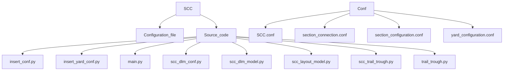

# scc

```mermaid
graph TD;
    SCC-->Configuration_file;
    SCC-->Source_code;
    Conf-->SCC.conf;
    Conf-->section_connection.conf;
    Conf-->section_configuration.conf;
    Conf-->yard_configuration.conf;
    Source_code-->insert_conf.py;
    Source_code-->insert_yard_conf.py;
    Source_code-->main.py;
    Source_code-->scc_dlm_conf.py;
    Source_code-->scc_dlm_model.py;
    Source_code-->scc_layout_model.py;
    Source_code-->scc_trail_trough.py;
    Source_code-->trail_trough.py;
```
