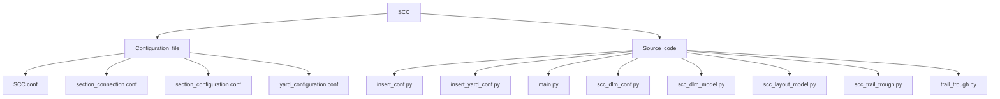

# scc

SCC - Siding Control Centre Module.

Configuration File - Files/settings which a program reads before startup.

Source Code File - Files containing sub modules.

SCC.conf - SCC configuration file contains Comment- Description of file.
                                            -Version - version of module.
                                            -SSC_ID - SSC Identifier.
                                            -Database - (Object Containing database of provider, User, Password, HOST Protocol, HOST IP address, Database name)
                                            -Local MQTT Broker - (Object Containing database of MQTT broker, Broker IP address, Username, Password, Port no. of the broker.
                                            -Total yard.
                                            -Total Section.

Section.conf - Section Configuration File.
                It is the file containing Detection Point direction in section IN and section OUT of all data points in a section.
                Version - version of module.
                                            -SSC_ID - SSC Identifier.
                                            -Database - (Object Containing database of provider, User, Password, HOST Protocol, HOST IP address, Database name)
                                            -Local MQTT Broker - (Object Containing database of MQTT broker, Broker IP address, Username, Password, Port no. of the broker.
                                            -Total yard.
                                            -Total Section.
                                            
Section_connection.conf - Section Configuration File.
                It is the file containing Detection Point direction in section IN and section OUT of all data points in a section.
                Version - version of module.
                                            -SSC_ID - SSC Identifier.
                                            -Database - (Object Containing database of provider, User, Password, HOST Protocol, HOST IP address, Database name)
                                            -Local MQTT Broker - (Object Containing database of MQTT broker, Broker IP address, Username, Password, Port no. of the broker.
                                            -Total yard.
                                            -Total Section.

yard_connection.conf - Section Configuration File.
                It is the file containing Detection Point direction in section IN and section OUT of all Datapoints in a section.
                Version - version of module.
                                            -SSC_ID - SSC Identifier.
                                            -Database - (Object Containing database of provider, User, Password, HOST Protocol, HOST IP address, Database name)
                                            -Local MQTT Broker - (Object Containing database of MQTT broker, Broker IP address, Username, Password, Port no. of broker.
                                            -Total yard.
                                            -Total Section.

scc_dlm_conf.py - data logging module configuration.
                    -It reads data from "scc.conf" validates it and store it in database.
                    
scc_dlm_model.py - data logging module to store data in PostgreSQL.

scc_layout_model.py - data logging module for layout section data to store data in PostgreSQL.

scc_dlm_api.py - data logging module to handle all API in scc website.

scc_trail_through.py - module to detect trail through and torpedo status.
main.py - main module for yard configuration and section information.
insert_conf.py - A module to take Siding Control Centre configuration insertion.
insert_yard_conf.py - A module to take yard configuration insertion.
scc_log.py - module to set-up logging.
